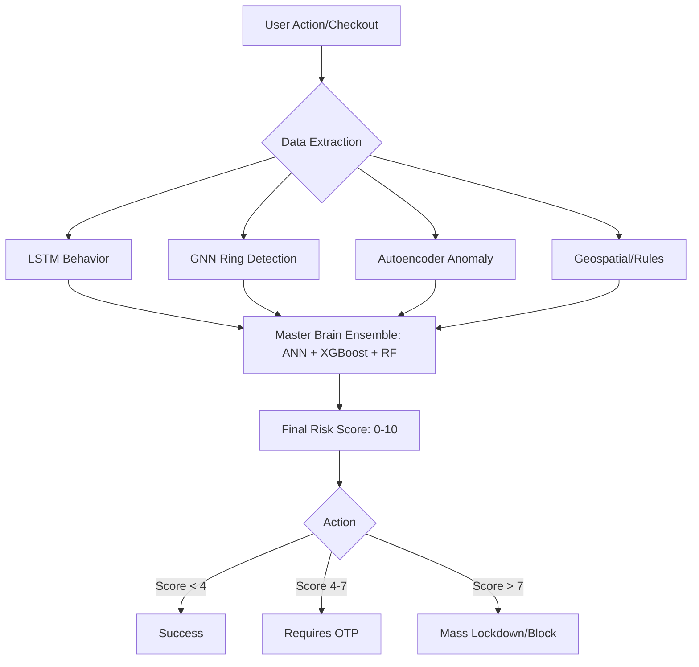

# TrackEasy Fraud Detection: How It Works

The TrackEasy Fraud System uses a **Multi-Layered AI Ensemble** architecture. Instead of relying on a single rule or model, it combines behavioral, structural, statistical, and geospatial signals into a single "Master Brain" decision.

---

## 1. Data Collection & Preprocessing
Every action a user takes (login, adding items, payment failures) is logged as an **Event**. When a user attempts to checkout, the system gathers:
- **Behavioral Sequence**: The last 10 actions (e.g., login -> item -> payment_fail -> checkout).
- **Structural Data**: Current user's connections (Shared IP, Address, or Phone).
- **Geospatial Data**: Current IP vs. Last known IP location (Latitude/Longitude).
- **Transaction Details**: Amount, Number of items, and Time of day.

---

## 2. Layer 1: Specialist ML Models (The Detectors)

The system runs several deep learning and machine learning "specialists" in parallel:

### 🧠 LSTM (Behavioral Model)
- **Focus**: Patterns of time.
- **How it works**: Uses a **Long Short-Term Memory** neural network to analyze the sequence of actions. It looks for "mechanical" patterns that suggest bots or "smash-and-grab" fraud rather than natural browsing.

### 🕸️ GNN (Structural Model)
- **Focus**: Fraud Rings.
- **How it works**: Uses a **Graph Neural Network** to look at the "hidden" network. If you share an address with 5 other people who have been blocked, the GNN identifies you as part of a "Fraud Ring" even if your behavior is currently normal.

### 📉 Autoencoder (Statistical Model)
- **Focus**: Outliers.
- **How it works**: An **Unsupervised Neural Network** that tries to "reconstruct" your transaction. If it can't reconstruct it accurately (High MSE), it means the transaction is statistically "weird" (e.g., a ₹50,000 order at 3:00 AM for someone who usually buys socks).

---

## 3. Layer 2: Rule-Based Security (The Hardcoded Guard)

These rules capture "common sense" fraud that models might miss without massive data:
- **"Superman" Check**: Calculates travel speed. If you move from Mumbai to New York in 10 minutes, the speed is flagged as >1000 km/h.
- **Velocity Spikes**: Flagging if a user adds 10x their usual order quantity in a single cart.

---

## 4. Layer 3: The "Master Brain" Ensemble (The Jury)

This is where the magic happens. The outputs of all previous layers (LSTM prob, GNN prob, Rule score, Autoencoder MSE, Speed, and Cluster Size) are fed into **three state-of-the-art classifiers**:

1.  **ANN (Artificial Neural Network)**: Learns complex non-linear combinations of signals.
2.  **XGBoost (Gradient Boosting)**: Excellent at prioritizing the most important features (like speed).
3.  **Random Forest**: Provides stability by "voting" across multiple decision trees.
4.  **Isolation Forest**: Detects global anomalies that don't fit any known fraud pattern.

**Final Decision**: These models produce a probability from **0 to 1**, which is then scaled to a **0-10 Risk Score**.

---

## 5. The Enforcement Flow

Based on the **Risk Score**, the Main Server takes immediate action:

| Risk Score | Level | Action Taken |
| :--- | :--- | :--- |
| **0 - 3** | 🟢 Low | **Allow**: Transaction processed normally. |
| **4 - 7** | 🟡 Med | **Challenge**: Trigger SMS OTP Verification. The user must prove they are real. |
| **8 - 10** | 🔴 High | **Block**: Permanent account suspension. Triggers admin/manager notifications. |

---

## Summary of the Decision Pipeline

