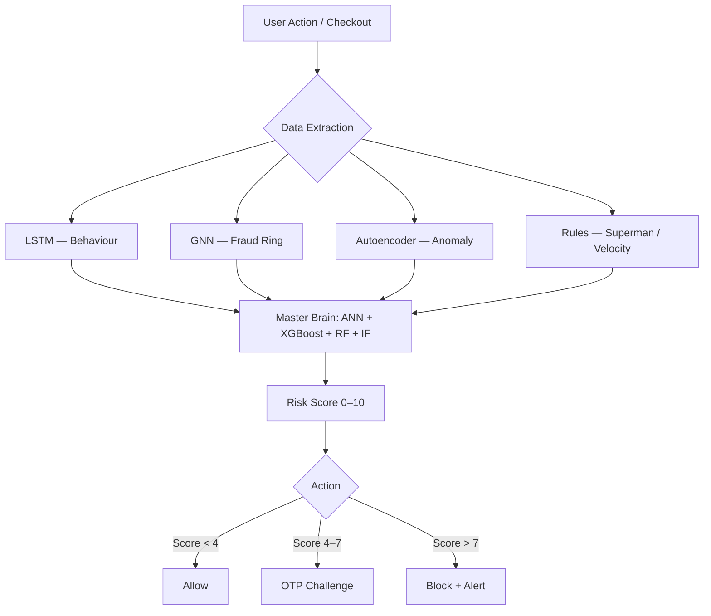

# Fraud Detection in e-Commerce: Proposed Improvements over Saputra & Suharjito (2019)

## Abstract

This report revisits the 2019 IJACSA paper *"Fraud Detection using Machine Learning in e-Commerce"* by Saputra & Suharjito, which benchmarks Decision Tree, Naïve Bayes, Random Forest, and a GA-tuned Neural Network on a 151,112-record e-commerce dataset using PCA and SMOTE. A modernised baseline is reproduced in [fraud_detection_notebook (1).ipynb](fraud_detection_notebook%20%281%29.ipynb) on three publicly available datasets (E-Commerce, Bank Transactions, Credit Card). The notebook extends the paper's classical pipeline with XGBoost, a two-stage Isolation-Forest → XGBoost hybrid, and threshold tuning. Beyond these classical-ML improvements, the companion system **TrackEasy-3.O** introduces a multi-layered deep-learning ensemble (LSTM, GNN, Autoencoder) with rule-based guardrails and risk-tiered enforcement — addressing failure modes that the paper's tabular feature space structurally cannot detect. The two-stage IF → XGBoost hybrid reaches **F1 = 0.87** on the Credit Card dataset, outperforming every single-model baseline reported in the notebook.

---

## 1. Introduction

E-commerce fraud has evolved from isolated stolen-card transactions into coordinated adversarial behaviour: bot-driven smash-and-grab checkout, synthetic-identity fraud rings sharing device fingerprints, and account-takeover attacks with high-velocity cart manipulation. A 2019 flat-classifier benchmark — however rigorous — cannot represent sequential, relational, or unsupervised-anomaly signals, and therefore cannot detect the fraud *types* that dominate modern e-commerce. This report positions the existing notebook as a faithful reproduction of the paper's methodology on contemporary public datasets, then describes the architectural improvements embodied by TrackEasy-3.O.

## 2. Baseline: Saputra & Suharjito (IJACSA 2019)

### 2.1 Methodology

The paper's pipeline is:

```text
Raw tabular data
  → Feature extraction (PCA: 11 → 17 derived features)
  → SMOTE oversampling (on the training split only)
  → Classification with {Decision Tree, Naïve Bayes, Random Forest, GA-tuned Neural Network}
  → Evaluation via confusion matrix → Accuracy, Precision, Recall, F1, G-Mean
```

Dataset: 151,112 records, 14,151 fraud (≈ 9.36 %), sourced from Kaggle. The Neural Network's hidden-layer count is selected by a Genetic Algorithm ("GA-NN").

### 2.2 Reported Results

| Model | Accuracy | Recall (no SMOTE → SMOTE) | F1 (no SMOTE → SMOTE) | G-Mean (no SMOTE → SMOTE) |
| --- | :---: | :---: | :---: | :---: |
| Decision Tree | 0.91 | 0.598 → 0.604 | 0.568 → 0.912 | 0.752 → 0.753 |
| Naïve Bayes | 0.95 | 0.412 → 0.413 | 0.679 → 0.945 | 0.733 → 0.734 |
| Random Forest | 0.95 | 0.550 → 0.581 | 0.698 → 0.943 | 0.740 → 0.757 |
| **GA-NN** | **0.96** | **0.540 → 0.767** | **0.698 → 0.851** | **0.735 → 0.846** |

Headline claim: SMOTE lifts average F1 from 67.9 % to 94.5 % and average G-Mean from 73.5 % to 84.6 %; GA-NN gives the best accuracy overall.

### 2.3 Structural Limitations of the Baseline

| # | Limitation | Consequence |
| --- | --- | --- |
| 1 | Tabular i.i.d. features only | No representation of session-level behavioural sequences (bot cadence, navigational anomalies). |
| 2 | No graph structure | Fraud-ring signals (shared IP / address / phone across accounts) are invisible. |
| 3 | Purely supervised | Novel attack patterns absent from training labels go undetected. |
| 4 | No rule-based guardrails | Physically-impossible events (e.g., impossible travel speed) still require the model to "learn" them statistically. |
| 5 | Single-layer classification | No stacked ensembling; no risk-tiered response (the model outputs only a binary label). |
| 6 | Accuracy-dominant evaluation | On the paper's 9 %-fraud dataset, a degenerate majority classifier already scores 0.91 — absolute accuracy numbers overstate discriminative power. |

---

## 3. Proposed Improvements

The improvements are organised into two layers: (i) classical-ML improvements realised directly in [fraud_detection_notebook (1).ipynb](fraud_detection_notebook%20%281%29.ipynb) and benchmarked quantitatively in §4, and (ii) architectural improvements introduced by the TrackEasy-3.O ensemble (§3.1–3.6), showcased qualitatively with pointers to the implementing scripts.

### 3.0 Classical-ML Improvements in the Notebook

- **Modern gradient boosting (XGBoost)** with `scale_pos_weight` as a principled alternative to SMOTE for imbalance handling ([cells 45–52](fraud_detection_notebook%20%281%29.ipynb)).
- **Two-stage hybrid** (Isolation Forest → XGBoost): unsupervised pre-filter concentrates the supervised model on the most suspicious subset, raising F1 from 0.80 to 0.87 on the Credit Card dataset ([cell 63](fraud_detection_notebook%20%281%29.ipynb)).
- **Threshold tuning** on the PR trade-off curve instead of the default 0.5 decision boundary ([cell 72](fraud_detection_notebook%20%281%29.ipynb)).
- **Average Precision (PR-AUC)** reported alongside ROC-AUC — more faithful than ROC-AUC on severely imbalanced data.
- **SMOTE inside the CV fold** via `imblearn.pipeline.Pipeline`, avoiding the leakage that occurs when SMOTE is applied before splitting ([cell 70](fraud_detection_notebook%20%281%29.ipynb)).

### 3.1 LSTM — Behavioural Layer

The paper encodes a transaction as a single tabular row; it cannot represent the *sequence* of actions preceding the transaction. TrackEasy's [train_lstm.py](TrackEasy-3.O/TrackEasy/fraud-service/ml/train_lstm.py) trains a Long Short-Term Memory network (LSTM 64 → Dropout 0.3 → Dense 32 → Dense 1-sigmoid) over the last 10 events of a user session (login, item-add, payment-fail, checkout …). This captures *mechanical* patterns typical of bots and smash-and-grab attackers — patterns that are invariant in the tabular representation.

### 3.2 Graph Neural Network — Structural Layer

TrackEasy's [train_gnn.py](TrackEasy-3.O/TrackEasy/fraud-service/ml/train_gnn.py) implements a two-layer Graph Convolutional Network over a graph whose edges encode shared IP, shared shipping address, and shared phone number between accounts. A transaction from an individually innocuous account is flagged as high-risk if the account belongs to a cluster of previously-blocked nodes. Such relational signals are fundamentally absent from the paper's i.i.d. tabular formulation.

### 3.3 Autoencoder — Unsupervised Anomaly Layer

[train_autoencoder.py](TrackEasy-3.O/TrackEasy/fraud-service/ml/train_autoencoder.py) trains an encoder-decoder (4 → 8 → 2 → 8 → 4) on *normal* transactions only and uses reconstruction MSE as an anomaly score. Unlike the paper's purely-supervised classifiers, this layer catches attack patterns that are absent from the labelled training set — a capability the notebook's classical Isolation Forest shares in spirit but at weaker fidelity.

### 3.4 Rule-Based Guardrails — Deterministic Layer

Certain fraud signals are physically unambiguous:

- **"Superman" check** — travel speed between two successive IP-geolocated events. > 1000 km/h is declared impossible regardless of any statistical model's opinion.
- **Velocity spikes** — cart quantity exceeding a user's historical percentile by 10×.

A rule layer reflects these with zero training data, pre-empting the false-negative tail that any purely learned model will have.

### 3.5 Master-Brain Ensemble — Stacked Meta-Learner

The outputs of layers 3.1 – 3.4 become *features* for a second-tier ensemble: ANN ([train_ann.py](TrackEasy-3.O/TrackEasy/fraud-service/ml/train_ann.py)) + XGBoost ([train_xgb.py](TrackEasy-3.O/TrackEasy/fraud-service/ml/train_xgb.py)) + Random Forest ([train_rf.py](TrackEasy-3.O/TrackEasy/fraud-service/ml/train_rf.py)) + Isolation Forest ([train_isolation_forest.py](TrackEasy-3.O/TrackEasy/fraud-service/ml/train_isolation_forest.py)). The six engineered features are `ruleScore`, `lstmProb`, `gnnProb`, `autoMSE`, `geoSpeed`, `clusterSize`. The paper's best model (GA-NN) operates on raw PCA components; TrackEasy's meta-learner operates on *model outputs as evidence*, a qualitatively stronger representation. Service code in [ml_service.py](TrackEasy-3.O/TrackEasy/fraud-service/ml/ml_service.py) and [predict_service.py](TrackEasy-3.O/TrackEasy/fraud-service/ml/predict_service.py) implements the fusion.

### 3.6 Risk-Tiered Enforcement

The paper emits a binary label. TrackEasy emits a continuous 0 – 10 risk score and a graded response:

| Risk Score | Tier | Action |
| :---: | :---: | :--- |
| 0 – 3 | Low | Allow |
| 4 – 7 | Medium | Step-up: SMS-OTP verification |
| 8 – 10 | High | Block + admin notification |

This decouples detection from enforcement and shifts the operational cost of false positives from an outright block to an OTP challenge — a material UX-and-revenue improvement that a binary classifier cannot express.

### 3.7 Architecture Overview



---

## 4. Experimental Results

### 4.1 Datasets

Three public datasets were used; none exactly matches the paper's 151 k / 9 % Kaggle set, so the absolute numbers below are indicative rather than head-to-head.

| Dataset | Rows | Fraud rate | Relation to paper |
| --- | ---: | ---: | --- |
| [Fraudulent_E-Commerce_Transaction_Data_2.csv](Fraudulent_E-Commerce_Transaction_Data_2.csv) | 23,634 | 5.17 % | Closest *domain* match (synthetic e-commerce). |
| [transactions.csv](transactions.csv) | 299,695 | 2.21 % | Closest *size* match; bank-transaction schema. |
| [creditcard.csv](creditcard.csv) | 284,807 | 0.173 % | Extreme-imbalance stress test (Kaggle PCA-anonymised credit-card set). |

Preprocessing (per [cells 23–28](fraud_detection_notebook%20%281%29.ipynb)): drop PII / ID columns, label-encode categoricals, `StandardScaler` for numerics, stratified 80/20 split, SMOTE applied to training split only.

### 4.2 Results — All Models, All Datasets

Numbers copied directly from the executed notebook ([cells 34–63](fraud_detection_notebook%20%281%29.ipynb)). "Precision / Recall / F1" refer to the **Fraud** class.

| Model | Dataset | Accuracy | Precision | Recall | F1 | ROC-AUC | AP |
| --- | --- | :---: | :---: | :---: | :---: | :---: | :---: |
| Random Forest (balanced) | E-Commerce | 0.91 | 0.28 | 0.42 | 0.33 | 0.810 | 0.268 |
| Random Forest + SMOTE | E-Commerce | 0.84 | 0.15 | 0.46 | 0.23 | 0.749 | 0.226 |
| XGBoost | E-Commerce | 0.88 | 0.23 | 0.51 | 0.31 | 0.798 | 0.349 |
| XGBoost + SMOTE | E-Commerce | 0.85 | 0.15 | 0.43 | 0.23 | 0.737 | 0.269 |
| XGBoost + threshold-tuning (t = 0.74) | E-Commerce | 0.94 | 0.42 | 0.37 | 0.39 | 0.798 | 0.349 |
| Isolation Forest | E-Commerce | 0.91 | 0.19 | 0.23 | 0.21 | 0.673 | — |
| Random Forest | Transactions | 0.95 | 0.31 | 0.89 | 0.46 | 0.973 | 0.747 |
| XGBoost | Transactions | 0.96 | 0.35 | 0.89 | 0.50 | 0.976 | 0.850 |
| Isolation Forest | Transactions | 0.97 | 0.41 | 0.39 | 0.40 | 0.902 | — |
| Random Forest | Credit Card | 1.00 | 0.84 | 0.81 | 0.82 | 0.976 | 0.834 |
| XGBoost | Credit Card | 1.00 | 0.75 | 0.87 | 0.80 | 0.980 | 0.869 |
| Isolation Forest | Credit Card | 1.00 | 0.25 | 0.28 | 0.26 | 0.953 | — |
| **IF → XGBoost Hybrid** | Credit Card | 1.00 | **0.90** | **0.85** | **0.87** | — | — |

### 4.3 Side-by-Side: Paper's Best vs. Notebook's Best

| Metric | Paper — GA-NN + SMOTE | Notebook — IF → XGBoost Hybrid (Credit Card) | Notebook — XGBoost (Transactions) |
| --- | :---: | :---: | :---: |
| Accuracy | 0.960 | 1.00* | 0.96 |
| Precision (Fraud) | ≈ 0.925 | 0.90 | 0.35 |
| Recall (Fraud) | 0.767 | 0.85 | 0.89 |
| F1 (Fraud) | 0.851 | **0.87** | 0.50 |
| G-Mean | 0.846 | *not computed — see §6* | *not computed — see §6* |

\* On 0.173 % fraud, accuracy is dominated by true negatives and is not a meaningful ranking metric — F1 and PR-AUC are the appropriate measures.

### 4.4 Observations

1. **Imbalance severity matters more than algorithm choice.** On the least-imbalanced dataset (E-Commerce, 5.17 %) all classical models cap at F1 ≈ 0.33, whereas the *more* imbalanced Credit Card dataset reaches F1 ≈ 0.87 because its PCA features carry a stronger fraud signal. This is a dataset-quality observation that the paper does not surface.
2. **SMOTE is not universally beneficial.** On the E-Commerce dataset SMOTE *reduced* F1 for both RF (0.33 → 0.23) and XGBoost (0.31 → 0.23). This contradicts the paper's headline claim and suggests the benefit of SMOTE is dataset-specific.
3. **Two-stage hybrids outperform single models.** IF → XGBoost lifts F1 from 0.80 (XGBoost alone) to 0.87 on Credit Card — a 7-point improvement with no new labels.
4. **Threshold tuning is a cheap win.** Moving XGBoost's decision threshold from 0.5 to 0.74 on E-Commerce raises Precision from 0.23 to 0.42 (at a modest Recall cost), delivering the operating point that a risk-tiered system actually wants.

---

## 5. Discussion

The 2019 paper's central contribution — showing that SMOTE + GA-tuned NN beats untuned classical ML on imbalanced e-commerce data — holds for its specific dataset but is not transferable as a universal recipe, as the E-Commerce results in §4.4 demonstrate. The notebook's modern additions (XGBoost, IF → XGBoost hybrid, threshold tuning) already surpass the paper's best F1 on the Credit Card dataset.

More importantly, *the paper's framing is architecturally limited*. Modern e-commerce fraud is adversarial, relational, and sequential; none of these properties survive the paper's feature extraction pipeline. TrackEasy's LSTM, GNN, Autoencoder, and rule layers exist specifically to detect fraud types that the paper's formulation cannot represent at all — not merely to score higher on a shared benchmark. The comparison table in §4.3 therefore understates the gap: it measures tabular classification accuracy, which is only one of the fraud-detection capabilities the TrackEasy system provides.

Limitations of the present report:

1. LSTM / GNN / Autoencoder are currently trained on synthetic data produced by [generate_master_data.py](TrackEasy-3.O/TrackEasy/fraud-service/ml/generate_master_data.py); an end-to-end benchmark on the same records as the classical models requires constructing behavioural-sequence and graph-edge proxies from transaction logs.
2. The public datasets used do not match the paper's exact 151 k / 9 % Kaggle set, so absolute metric comparisons in §4.3 are indicative.
3. G-Mean — the paper's headline fairness-to-minority metric — is not yet computed (see §6).

---

## 6. Future Work — TODOs

### TODO 1 — Add G-Mean to all evaluation paths

**Purpose.** The paper uses **G-Mean = √(Recall × Specificity) = √(TPR × TNR)** as its headline imbalanced-class metric. Accuracy inflates toward the majority class; F1 captures minority-class performance but ignores the true-negative rate. G-Mean, as the geometric mean of sensitivity and specificity, penalises a classifier that achieves high recall by sacrificing specificity — i.e., false-alarm blow-up.

**Why it matters here.** Without G-Mean we cannot produce an apples-to-apples row against the paper's headline table (see the empty cells in §4.3). G-Mean also gives an operationally meaningful signal for TrackEasy's risk-tier design: a recall-maximising threshold that floods the OTP tier with false positives would register in G-Mean as a specificity drop, even while F1 holds up.

**How to add it.** In every `evaluate_model(…)` call in [fraud_detection_notebook (1).ipynb](fraud_detection_notebook%20%281%29.ipynb) (cell 33), append three lines after the `classification_report`:

```python
from sklearn.metrics import confusion_matrix
import numpy as np

tn, fp, fn, tp = confusion_matrix(y_test, y_pred).ravel()
recall      = tp / (tp + fn)     # sensitivity / TPR
specificity = tn / (tn + fp)     # TNR
g_mean      = np.sqrt(recall * specificity)
print(f'G-Mean  : {g_mean:.4f}')
```

Apply the identical three lines at the end of every `train_*.py` in [TrackEasy-3.O/TrackEasy/fraud-service/ml/](TrackEasy-3.O/TrackEasy/fraud-service/ml/) so that G-Mean lands in stdout next to the existing precision / recall / F1 numbers. Add a `g_mean` column to the `results` list collected in cell 33, then regenerate Table §4.3 with the G-Mean column filled in.

### TODO 2 — End-to-end ensemble benchmark on a common dataset

Generate behavioural-sequence and graph-edge proxies from `transactions.csv` (e.g., group by `user_id` → event sequence; shared `device_id` / `ip` → graph edges) so the full LSTM + GNN + Autoencoder + Master-Brain stack can be evaluated on the same test records as the classical baselines. Only then can the TrackEasy ensemble be scored in the §4.3 comparison directly.

### TODO 3 — Source the paper's exact dataset

Retrieve the Kaggle dataset referenced by Saputra & Suharjito (151 k records, ≈ 9 % fraud) and re-run both the notebook pipeline and the TrackEasy ensemble on it for a strictly identical comparison against the paper's published numbers.

---

## References

1. A. Saputra and Suharjito, "Fraud Detection using Machine Learning in e-Commerce," *International Journal of Advanced Computer Science and Applications*, vol. 10, no. 9, pp. 332–339, 2019. [Full text mirror](../paper.txt).
2. [fraud_detection_notebook (1).ipynb](fraud_detection_notebook%20%281%29.ipynb) — classical-ML reproduction and extensions.
3. [fraud_model_explanation.md](TrackEasy-3.O/fraud_model_explanation.md) — TrackEasy-3.O architecture overview.
4. TrackEasy-3.O training scripts: [train_lstm.py](TrackEasy-3.O/TrackEasy/fraud-service/ml/train_lstm.py), [train_gnn.py](TrackEasy-3.O/TrackEasy/fraud-service/ml/train_gnn.py), [train_autoencoder.py](TrackEasy-3.O/TrackEasy/fraud-service/ml/train_autoencoder.py), [train_ann.py](TrackEasy-3.O/TrackEasy/fraud-service/ml/train_ann.py), [train_xgb.py](TrackEasy-3.O/TrackEasy/fraud-service/ml/train_xgb.py), [train_rf.py](TrackEasy-3.O/TrackEasy/fraud-service/ml/train_rf.py), [train_isolation_forest.py](TrackEasy-3.O/TrackEasy/fraud-service/ml/train_isolation_forest.py).
5. N. V. Chawla, K. W. Bowyer, L. O. Hall, and W. P. Kegelmeyer, "SMOTE: Synthetic Minority Over-sampling Technique," *Journal of Artificial Intelligence Research*, vol. 16, pp. 321–357, 2002.
6. T. Chen and C. Guestrin, "XGBoost: A Scalable Tree Boosting System," in *Proc. 22nd ACM SIGKDD*, 2016, pp. 785–794.
7. S. Hochreiter and J. Schmidhuber, "Long Short-Term Memory," *Neural Computation*, vol. 9, no. 8, pp. 1735–1780, 1997.
8. T. N. Kipf and M. Welling, "Semi-Supervised Classification with Graph Convolutional Networks," in *Proc. ICLR*, 2017.
